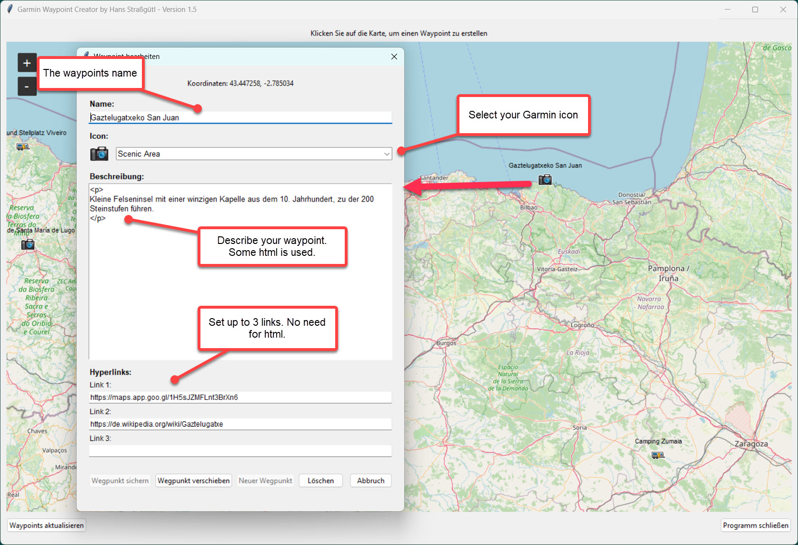
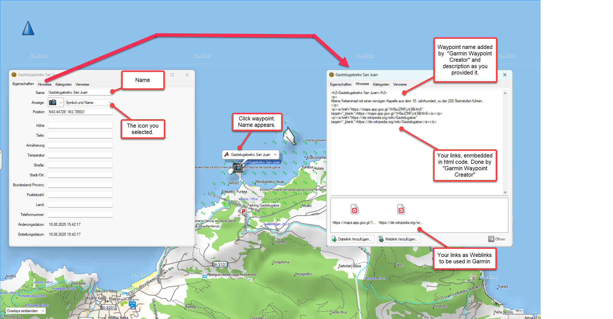
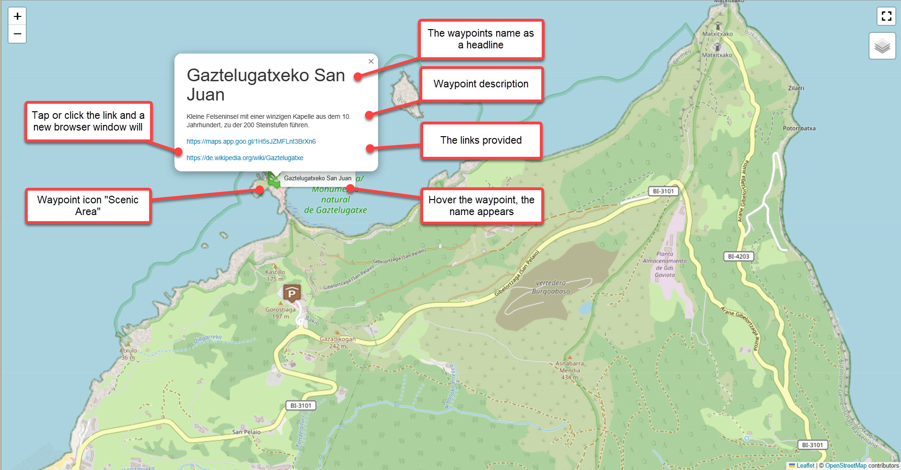
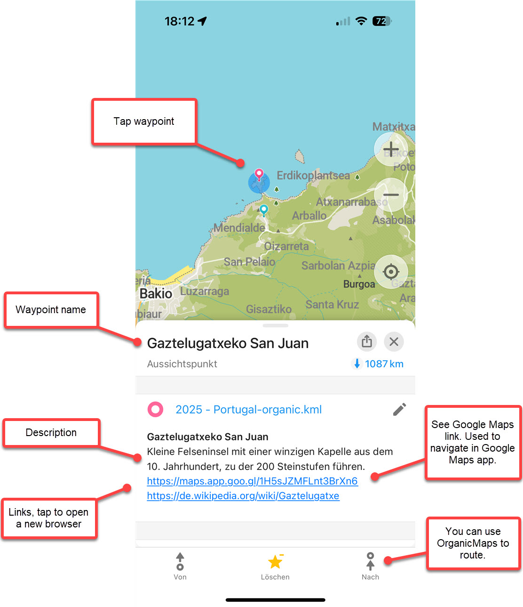

# Garmin Waypoint Creator
## Version and licence
Version v1.5 dated 08/2025 
Written by Hans Strassguetl - https://gravelmaps.de   
Licenced under [https://creativecommons.org/licenses/by-sa/4.0/](https://creativecommons.org/licenses/by-sa/4.0/)

## About
Garmin uses a unique GPX waypoint implementation. These waypoints may contain links and their own icon set.

This program lets you create and edit such GPX waypoints. Each waypoint is stored in its own file, which you can later import into Basecamp.

Existing waypoints must stay in the same folder where garmin_waypoint_creator resides.

In order to display the text of the waypoints later ideally in websites or in Oruxmaps (see gpx_2_html and gpx_2_kml_4_orux), the waypoints text (notes) should already be prepared in html.

## Garmin Icons
I found the provided icons in the depths of the internet. I'm not sure about the copyright.

## Use

Create your waypoint using "Garmin Waypoint Creator"

Waypoint after you imported it in Basecamp.

Look at the waypoint in case you use "gpx_2_html"

Look at the waypoint in case you use "gpx_2_kml_4_orga"

